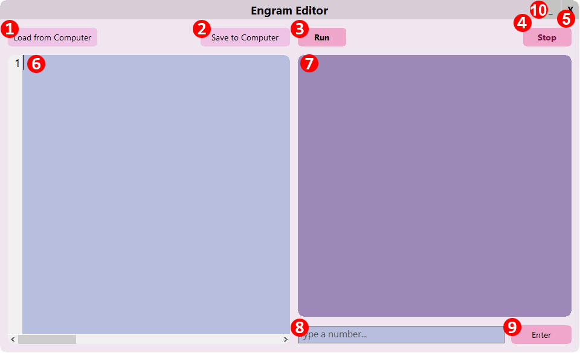

# Introduction
The Engram Editor is a Windows-only application where you can write and run code written for Engram. You can save Engram programs to your computer and load them later.

# What's What in the Engram Editor

| Number | Name | Description |
| ---------- | ----------- | ------- |
| 1 | Load from Computer | After pushing this button, you can select a `.txt` file from your computer. The chosen text file will be put into the **Code Editor** (see item #6). |
| 2 | Save to Computer | When you select this button, you can save the text in the **Code Editor** to your computer. The default file name is `engram.txt`, but you can change it before saving the file. |
| 3 | Run | Starts running the program written in the **Code Editor**. All output will be displayed in the **Output Viewer** (see item #7), and when necessary, you can send input to the running program through the **Input Field** (see item #8). Keep in mind that while the program is running, the **Run** button is disabled, meaning you cannot run a program if one is already running. |
| 4 | Stop | The **Stop** button can only be clicked while a program is running. Clicking the **Stop** button terminates the program. |
| 5 | Exit | Closes the Engram Editor. |
| 6 | Code Editor | This is where you will write, edit, and debug your Engram code. The **Code Editor** automatically highlights all keywords and numbers. Line numbers are displayed on the left-hand side of the **Code Editor** to help you find any syntax errors that may occur when running your program. |
| 7 | Output Viewer | Here you can view the output of your program, including any error messages or warnings. |
| 8 | Input Field | You can type a number into the **Input Field** to send it to your running program. Only numbers are accepted in this field. Once you have typed the number, you can press Enter on your keyboard or press the **Enter** button (see item #9). |
| 9 | Enter | Sends the number written in the **Input Field** to the running program. |
| 10 | Minimize | Minimizes the Engram Editor to the Windows taskbar. |

## Next Section
[Writing Your First Program](4-helloworld.md)

## Previous Section
[Downloading Engram](2-download.md)
